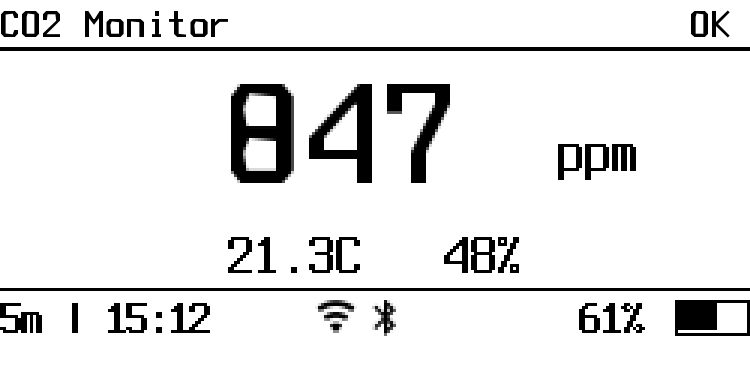
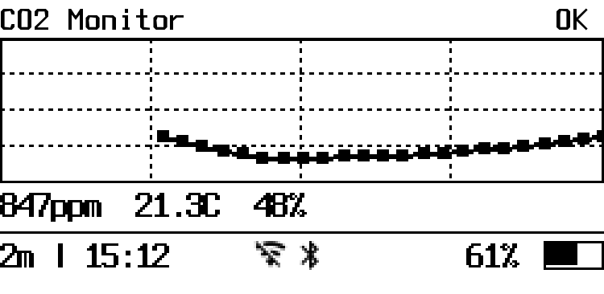

# CO2 Monitor

Battery-powered CO2 monitor with e-ink display, BLE broadcasting, and deep sleep for extended battery life.

Built with [ESPHome](https://esphome.io/) firmware running on ESP32.

## Hardware Components

| Component | Model | Purpose |
|-----------|-------|---------|
| MCU + Display | [LilyGo TTGO T5 V2.3.1](http://www.lilygo.cn/prod_view.aspx?TypeId=50031&Id=1150) | ESP32 with built-in 2.13" e-ink display (250x122px) |
| CO2 Sensor | [Sensirion SCD41](https://sensirion.com/products/catalog/SCD41/) | CO2 (400-5000 ppm), temperature, humidity |
| Battery | 3.7V LiPo | Any single-cell Li-Ion/LiPo with JST connector |

## Wiring

The SCD41 connects to the TTGO T5 via I2C:

```
TTGO T5          SCD41
────────         ─────
3.3V  ──────────  VCC
GND   ──────────  GND
GPIO21 (SDA) ───  SDA
GPIO22 (SCL) ───  SCL
```

The e-ink display and button are built into the TTGO T5 board (no extra wiring needed).

Battery connects to the board's JST battery connector. Voltage is monitored via the built-in voltage divider on GPIO35.

## Display Layouts

### Layout 0 — CO2 + Info
Large CO2 reading with temperature and humidity below.



### Layout 1 — CO2 + Graph
1-hour CO2 history graph with 2px lines, 5x5 dots, dotted grid, and current readings.



### Bottom Bar (both layouts)
`interval | HH:MM` + WiFi icon + BLE icon + battery % with icon

## Button Controls

Single physical button (GPIO39) with three actions:

| Action | Function |
|--------|----------|
| **Single click** | Switch display layout (0 ↔ 1) |
| **Double click** | Toggle WiFi ON/OFF (enables/disables deep sleep) |
| **Long press** (1-5s) | Cycle measurement interval: 1 min → 2 min → 5 min |

In deep sleep mode, a button press wakes the device and switches layout.

## Operating Modes

### WiFi ON (always awake)
- Measures CO2/temp/humidity on the configured interval
- Publishes via ESPHome native API
- BLE advertising runs continuously
- Supports OTA firmware updates
- NTP time sync

### WiFi OFF (deep sleep)
- Wakes from deep sleep → measures → updates display → BLE burst (3 packets/6s) → sleeps
- Wake cycle takes ~12 seconds
- BLE radio is OFF during sleep
- Battery life: days to weeks depending on interval

## Home Integration

### BLE → Homebridge → Apple Home
The device broadcasts sensor data using [BTHome v2](https://bthome.io/) protocol via BLE advertising:
- CO2 (ppm)
- Temperature (°C)
- Humidity (%)
- Battery (%)

A Raspberry Pi running [Homebridge](https://homebridge.io/) with the [BTHome plugin](https://github.com/nicoh88/homebridge-bthome) receives the broadcasts and exposes the sensors to Apple HomeKit.

### ESPHome Native API
When WiFi is ON, the device also publishes via ESPHome's native API for integration with [Home Assistant](https://www.home-assistant.io/).

## Setup

### Requirements
- Python 3.x
- ESPHome (`pip install esphome`)

### Steps

1. Clone this repository

2. Create `co2-sensor/secrets.yaml`:
   ```yaml
   wifi_ssid: "your-wifi-ssid"
   wifi_password: "your-wifi-password"
   api_key: "base64-encoded-32-byte-key"
   ota_password: "your-ota-password"
   ```

   Generate an API key:
   ```bash
   python3 -c "import base64, os; print(base64.b64encode(os.urandom(32)).decode())"
   ```

3. Create `co2-sensor/local.yaml` from the example:
   ```bash
   cp co2-sensor/local.yaml.example co2-sensor/local.yaml
   ```

   Edit it with your network and display settings:
   ```yaml
   static_ip: "192.168.1.100"
   gateway: "192.168.1.1"
   subnet: "255.255.255.0"
   timezone: "America/New_York"
   display_name: "Home"
   fallback_ap_ssid: "co2-sensor-fallback"
   fallback_ap_password: "changeme"
   ```

4. Flash via USB (first time):
   ```bash
   python3 -m venv .venv && source .venv/bin/activate
   pip install esphome
   esphome run co2-sensor/co2-sensor.yaml
   ```

5. Subsequent updates via OTA (WiFi must be ON — double-click button to enable):
   ```bash
   esphome upload co2-sensor/co2-sensor.yaml --device <your-static-ip>
   ```

## Case

3D-printable case by [emariete](https://emariete.com/en/co2-meter-co2-gadget-low-power-with-lilygo-ttgo-t5-epaper-and-sensor-sensirion-scd41/):

[Tinkercad — CO2 Gadget LilyGo TTGO T5 2.13 + Sensirion SCD41](https://www.tinkercad.com/things/bTNL0jCvHew-co2-gadget-lilygo-ttgo-t5-213-sensirion-scd41)

## Similar Projects

- [CO2-Gadget](https://github.com/melkati/CO2-Gadget) — Feature-rich CO2 monitor firmware (Arduino, not ESPHome) with support for multiple sensors and displays. The case design used in this project originates from the CO2-Gadget community.

## Project Structure

```
co2-sensor/
  co2-sensor.yaml    # Main ESPHome configuration (sensors, display, BLE, deep sleep)
  rtc_graph.h         # RTC-persistent circular buffer for CO2 history
  secrets.yaml        # WiFi/API credentials (not committed)
  local.yaml          # Local network/display settings (not committed)
  local.yaml.example  # Template for local.yaml
  fonts/              # Terminus + Material Design Icons for e-ink display
  layout0.png         # Layout 0 preview
  layout1.png         # Layout 1 preview
  battery-log.json    # Battery consumption test data (not committed)
```
